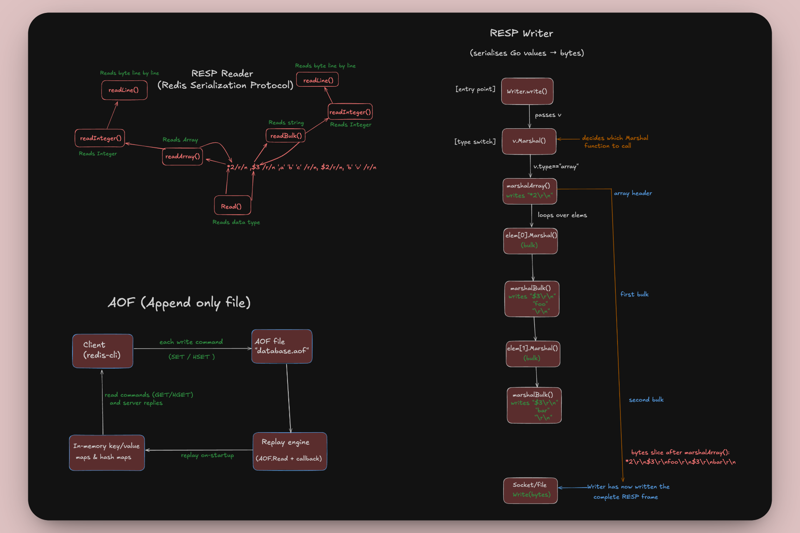

# Redis from Scratch in Go

A lightweight Redis implementation built from scratch in Go, featuring core Redis functionality including the RESP protocol, data persistence, and essential commands.



## 🚀 Features

- **RESP Protocol Implementation**: Full support for Redis Serialization Protocol
- **Core Redis Commands**: SET, GET, HSET, HGET, HGETALL, PING
- **Data Persistence**: Append-Only File (AOF) for data durability
- **Concurrent Access**: Thread-safe operations with proper mutex handling
- **TCP Server**: Listens on port 6969 for client connections

## 📁 Project Structure

```
go-redis/
├── main.go      # Main server implementation and connection handling
├── resp.go      # Redis Serialization Protocol implementation
├── handler.go   # Command handlers for Redis operations
├── aof.go       # Append-Only File persistence mechanism
├── go.mod       # Go module definition
└── public/      # Documentation images
    ├── AOF.png
    ├── Redis-in-go.png
    ├── RESP-Reader.png
    └── RESP-writer.png
```

## 🏗️ Architecture Overview

### RESP Protocol
The Redis Serialization Protocol (RESP) implementation handles:
- **Data Types**: Strings, Bulk Strings, Arrays, Integers, Errors, Null values
- **Parsing**: Efficient byte-level parsing of Redis protocol messages
- **Serialization**: Converting Go values back to RESP format


### Command Handlers
Implemented Redis commands:
- `PING` - Test server connectivity
- `SET key value` - Set a string key-value pair
- `GET key` - Retrieve a string value by key
- `HSET hash field value` - Set a field in a hash
- `HGET hash field` - Get a field value from a hash
- `HGETALL hash` - Get all fields and values from a hash

### AOF Persistence


The Append-Only File mechanism provides:
- **Durability**: All write operations are logged to disk
- **Recovery**: Commands are replayed on server startup
- **Background Sync**: Automatic file synchronization every second

## 🚀 Quick Start

### Prerequisites
- Go 1.23.5 or later

### Installation & Running

1. Clone the repository:
```bash
git clone https://github.com/abhinavkale-dev/go-redis.git
cd go-redis
```

2. Run the server:
```bash
go run .
```

The server will start listening on port 6969.

### Connecting to the Server

You can connect using any Redis client or telnet:

```bash
# Using redis-cli (if you have Redis installed)
redis-cli -p 6969

# Using telnet
telnet localhost 6969
```

### Example Usage

```bash
# Test connectivity
PING
# Response: PONG

# Set a key-value pair
SET mykey "Hello, Redis!"
# Response: OK

# Get the value
GET mykey
# Response: "Hello, Redis!"

# Hash operations
HSET user:1 name "John Doe"
HSET user:1 email "john@example.com"
HGET user:1 name
# Response: "John Doe"

HGETALL user:1
# Response: Array with all fields and values
```

## 🔧 Technical Details

### Concurrency
- Thread-safe operations using `sync.RWMutex`
- Separate mutexes for string storage (`SETs`) and hash storage (`HSETs`)
- Background AOF synchronization with proper locking

### Memory Management
- In-memory storage using Go maps
- Efficient string and hash data structures
- Minimal memory allocations in the RESP parser

### Error Handling
- Proper RESP error responses for invalid commands
- Graceful handling of connection errors
- Input validation for all commands

## 🛠️ Development

### Adding New Commands

1. Add the command handler to `handler.go`:
```go
func newCommand(args []Value) Value {
    // Implementation here
}
```

2. Register the handler in the `handlers` map:
```go
var handlers = map[string]func([]Value) Value{
    // ... existing handlers
    "NEWCOMM": newCommand,
}
```

3. Add AOF logging if the command modifies data (in `main.go`):
```go
if command == "SET" || command == "HSET" || command == "NEWCOMM" {
    aof.Write(value)
}
```

## 📝 License

This project is open source and available under the MIT License.

## 🤝 Contributing

Contributions are welcome! Please feel free to submit a Pull Request.

## 🎯 Future Enhancements

- [ ] Add more Redis commands (DEL, EXISTS, EXPIRE, etc.)
- [ ] Implement Redis pub/sub functionality
- [ ] Add support for Redis Modules
- [ ] Implement clustering support
- [ ] Add comprehensive test suite
- [ ] Performance benchmarking

---

**Note**: This is an educational implementation. For production use, consider using the official Redis server. 